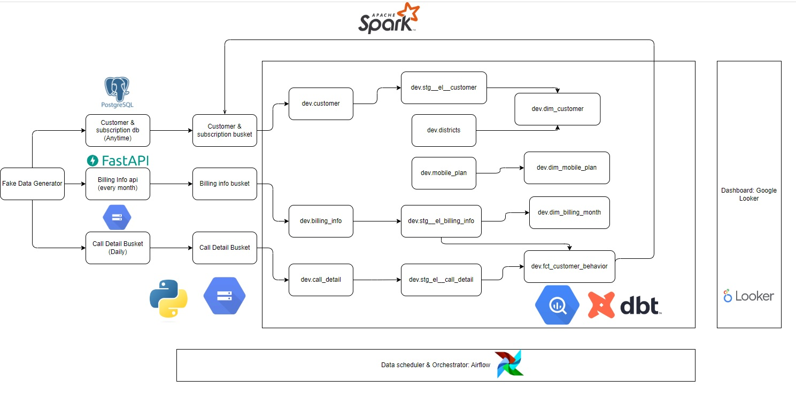

# Simulated Telecom Data Pipeline

## Overview
The Simulated Telecom Data Pipeline project is designed to practice data engineering skills by creating an end-to-end batch data pipeline. The aim is to pull data from multiple sources and transform it into a format that can be used to create visualizations. The data is simulated and includes billing statements, customer information, subscription status, plan details, and call detail records.

## Architecture Diagram

## Tools Used
The following tools were used to process the data:
- Source: Postgres/FastAPI/local CSV
- Staging: GCS (Parquet)
- Destination: BigQuery (Partition defined)
- Transformation: Python(EL)/dbt
- Orchestration: Airflow
- IAC: Terraform
- Serving: Google Looker Studio
- Reverse ETL: Spark (simple ML classify model) + BigQuery

## Inspiration
This project was inspired by [Start Data Engineering Blog](https://www.startdataengineering.com/post/data-engineering-project-e2e/). The project provided a great starting point for building an end to end batch data pipeline.

**Note:** This project is still in progress and not yet completed.